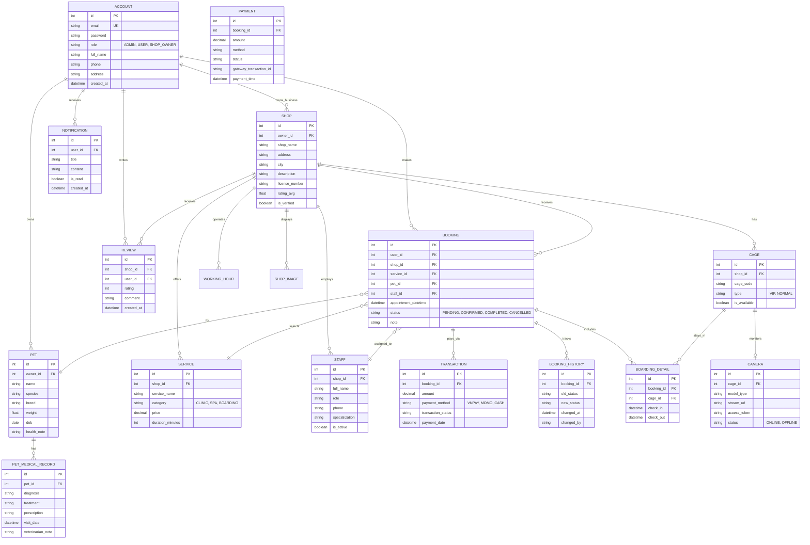

# PET EYE PROJECT - Backend

## Project Overview
This is the backend system for the **PET EYE** application, a platform for pet care services including clinic, spa, and boarding with live camera monitoring.

## Technology Stack
- **Framework**: Spring Boot 3.5.x
- **Database**: MySQL
- **ORM**: Spring Data JPA (Hibernate)
- **Mapping**: MapStruct
- **Security**: Spring Security + JWT
- **Lombok**: Reduced boilerplate code

## ERD Diagram

## How to Run
1.  Ensure MySQL is running and database `PET_EYE` is created.
2.  Update `src/main/resources/application-local.yml` with your database credentials.
3.  Run the application using `./mvnw spring-boot:run`.
4.  Access **Swagger UI** at: `http://localhost:8080/api/swagger-ui/index.html` (Note: context-path is `/api`)

## Main API Endpoints
- `/users`: User registration and management
- `/auth`: Authentication and JWT token generation
- `swagger-ui.html`: Documentation for all CRUD APIs
